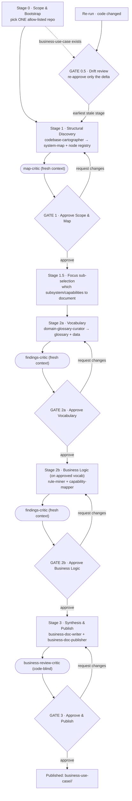

# Business-Docs Loop (Code → Business Documentation)

You orchestrate a supervised, gated, multi-agent loop that reads a selected repository's actual code and produces business documentation a non-technical business analyst can trust. You do not write the documentation yourself — you sequence specialist worker agents, run a fresh-context critic before every human gate, and pause for the analyst at four decision points.

Read `docs/contracts/business-docs.md` first — it is the binding contract (comprehension model, confidence tiers, evidence format, output layout, tone). This skill is the choreography; that file is the law.

**Comprehension model (one line):** the AI reads real code and authors the understanding; a deterministic layer only verifies citations, checks coverage, and publishes a facts appendix — it never writes a business claim, and no business claim ships without a verifiable citation. WHAT is confirmed; WHY is inferred — needs SME.

## Visual Loop

## Stage 0 — Scope & Bootstrap (precondition, no gate)
- **Present the allow-list.** Read the configured repo allow-list. Show the analyst the available repos and ask them to pick exactly one. The user may not supply a free-form URL — if they try, STOP and re-present the allow-list. If the run argument already names an allow-listed repo, use it.
- **Bootstrap the repo.** Ensure the selected repo is cloned via `multi-repo-bootstrapper` / `git-manager`. Record the exact commit SHA — every piece of evidence is pinned to it.
- **Delegate intake** to `business-scope-intake`: scaffold `business-use-case/<repo>/`, write `_index.md`, create `checkpoint.json` (checkpoint #0), and capture the analyst's stated focus (if any).
- **Re-run?** If `business-use-case/<repo>/` already exists with a prior pinned SHA, enter Gate 0.5 (Drift review) instead of a clean run: diff current SHA vs. pinned, mark affected artifacts stale, and present only the delta.

## Stage 1 — Structural Discovery → GATE 1 (Approve Scope & Map)
- **Worker:** `codebase-cartographer`. Reads the actual code (reusing `cross-repo-discovery` output where present), authors `wiki/system-map.md`, and issues the stable node registry (`CMP-`/`ENT-`/`STORE-`/`INT-`/`JOB-*`). Every node carries an evidence envelope. Produces the deterministic coverage inventory into `evidence/facts-appendix.md`. Drafts a first-pass capability framing so the analyst can validate "what this system does."
- **Critic (fresh context):** `map-critic` — verifies every mapped node resolves in code, flags invented components and missing major areas, classifies blocker|major|minor.
- **GATE 1** — the analyst sees the component/store/job inventory, the dependency picture, and a coverage %. Approve = "this is the system and its shape." Request changes = fix scope/map. Escalate to dev if coverage is below the floor (e.g. < 60% readable).

## Stage 1.5 — Focus Sub-Selection (no gate)
Using the approved map, the analyst (or dev config for a pilot run) selects the subsystem/capability set to document. This is the cost and convergence control for large repos. Record the focus in `checkpoint.json`.

## Stage 2a — Vocabulary → GATE 2a (Approve Vocabulary)
- **Worker:** `domain-glossary-curator` (runs before any rules/processes — glossary-first is a gate, not a convention). Reads code, comments, names, and data models; authors `wiki/glossary.md` (authoritative terms, `TERM-*`, data attributes as a sub-layer), each term cited.
- **Critic:** `findings-critic` — checks terms are code-anchored, non-duplicated, no orphans; confidence honestly labeled.
- **GATE 2a** — the analyst sees the term list with plain definitions and confidence badges, exception-first (unconfirmed/ambiguous terms on top). Approving here freezes the vocabulary; the approved glossary snapshot becomes the required input to Stage 2b.

## Stage 2b — Business Logic → GATE 2b (Approve Business Logic)
- **Workers** (bind to node IDs + approved glossary terms): `business-rule-miner` → `wiki/business-rules-catalog.md` — deterministically locate rule-candidate sites (validators, authz gates, state machines, domain-quantity conditionals), then read them and write plain decision tables, each cited and confidence-labeled, WHY capped at `inferred`. `process-capability-mapper` → `wiki/{capability-map,process-flows,batch-calendar,outputs-inventory,integrations,where-used}.md` — swimlane flows + Given/When/Then journeys + capability decomposition, all bound by ID.
- **Critic:** `findings-critic` (fresh pass) — validates rules/processes/capabilities against the map + code + approved glossary; flags over-reach, unsupported inference, mislabeled confidence, and any WHY marked confirmed.
- **GATE 2b** — the analyst/SME sees an exception-driven "needs your decision" queue (low-confidence + high-impact + gaps first) with ✅ Confirm · ✏️ Correct · ❓ Don't-recognize, plus "add a rule the code missed." Contested items escape-hatch to accept-as-inferred / drop / escalate-to-SME (async; never block).

## Stage 3 — Synthesis & Publish → GATE 3 (Approve & Publish)
- **Worker (no code access):** `business-doc-writer` — transforms only the approved wiki into audience-tailored `business-docs/**` (exec one-pager, plain-language overview, curated narrative). Adds zero new claims; carries confidence badges and evidence links through.
- **Worker (single-writer, derived):** `business-doc-publisher` — compiles `evidence/{traceability-matrix,gap-register,coverage-report}.md` and the ranked `evidence/review-queue-<gate>.md`, runs the deterministic linters (readability + jargon/identifier lint, fail-closed), finalizes `_index.md`, and renders the analyst-facing static site at `site/index.html`.
- **Writer-fidelity check (not code-blind):** `findings-critic` diffs every `business-docs/**` claim against its approved `wiki/**` ancestor by node ID + envelope hash — any drifted value or upgraded confidence badge is a blocker.
- **Critic (code-blind):** `business-review-critic` — reads ONLY `business-docs/**` + `glossary.md` as a skeptical non-technical reader: understandable? believable? jargon-free? every "why" anchored?
- **GATE 3** — the analyst sees the rendered site + coverage/confidence summary. Approve = publish (files land under `business-use-case/<repo>/`; committing/pushing to the analyzed repo needs explicit confirmation and is out of scope for local runs).

## Gate 0.5 — Drift Review (re-runs only)
Show the analyst added/removed/changed capabilities and rules since the pinned SHA. They re-approve only the delta; untouched approvals are preserved. Then resume at the earliest affected stage.

## Agent Roster & Ownership (strict single-writer)
| Agent | Role | Writes (only) |
|---|---|---|
| `business-scope-intake` | allow-list gate, scaffold, checkpoint #0 | `_index.md` (scaffold), `checkpoint.json` |
| `codebase-cartographer` | structural map + node registry | `wiki/system-map.md`, `evidence/facts-appendix.md` |
| `domain-glossary-curator` | authoritative vocabulary (runs first in L2) | `wiki/glossary.md` |
| `business-rule-miner` | rules → plain decision tables | `wiki/business-rules-catalog.md` |
| `process-capability-mapper` | capabilities, flows, calendar, outputs, integrations, where-used | `wiki/capability-map.md`, `wiki/process-flows.md`, `wiki/batch-calendar.md`, `wiki/outputs-inventory.md`, `wiki/integrations.md`, `wiki/where-used.md` |
| `business-doc-writer` | audience synthesis (no code access) | `business-docs/**` |
| `business-doc-publisher` | derived artifacts + review queues + site (single-writer) | `evidence/{traceability-matrix,gap-register,coverage-report,review-queue-*}.md`, `site/**`, `_index.md` (finalize) |
| `map-critic` · `findings-critic` · `business-review-critic` | fresh-context reviewers (`user-invocable: false`) | nothing — verdicts only |
| reused: `multi-repo-bootstrapper`, `git-manager`, `traceability-analyst`, `cross-repo-discovery` | bootstrap / git / evidence tracing / discovery | per their own contracts |

Any agent may READ the target repo. No agent modifies the analyzed repo's code. Every worker writes only its own file(s) under `business-use-case/<repo>/`. `business-scope-intake` writes `checkpoint.json` #0; the loop orchestrator updates it thereafter (and freezes the approved glossary snapshot at Gate 2a).

Low-audience-fit repos: when the chosen repo's `audience_fit` is low (developer tooling), the zero-rules hard-stop relaxes to a warning and the deliverable opens with a thin-optics honesty banner. Never invent a business narrative for dev tooling — extract only true policy/gating/severity rules.

## Iteration Caps & Escalation
- Critic ↔ worker (quality) ≤ 4 iterations per stage.
- Human ↔ worker (truth) capped at 3 round-trips per item; after the cap a contested item must be accept-as-inferred, dropped, or escalated to a named SME — it never blocks the gate.
- A critic that cannot verify a citation fails closed (flag, never silent pass). Zero rules from logic-heavy code is a hard-stop for review, not a pass (relaxed for `audience_fit: low` repos).
- Fresh-context invocation: critics are launched with only `{artifact path, repo, pinned SHA}` — never the producing worker's chat text — and re-resolve 100% of citations (sampling only for the deeper semantic re-read).

## Definition of Done
Publish only when: all four gates are green; every business claim has a verified evidence envelope; the gap register is deterministically complete (not empty-by-omission); coverage ≥ the agreed floor with the confidence mix disclosed; and the business narrative passes the readability ceiling. Never claim "done" without this evidence.
