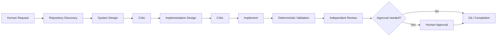

# agentic-dev-kit

A vendor-neutral, repository-native toolkit for disciplined AI-assisted software engineering across **OpenAI Codex**, **GitHub Copilot**, and **Claude Code**.

> Non-deterministic AI reasoning should be surrounded by deterministic engineering controls.

Rather than giving one general-purpose coding agent unlimited freedom, this project separates discovery, architecture, implementation planning, coding, independent review, and Git responsibilities into explicit roles with evidence requirements and deterministic validation.

## v0.1

- Shared cross-tool policy in `AGENTS.md`
- GitHub Copilot custom agents, prompts, and path-specific instructions
- Claude Code agent profiles and skills
- Codex-compatible skills in `.agents/skills`
- Roles for repository analysis, system design, implementation design, implementation, critique, and Git
- Workflows for brownfield discovery, design/build, and knowledge discovery
- Deterministic repository validation and skill synchronization

v0.1 is intentionally **instruction- and workflow-first**. Executable LangGraph / Strands orchestration is planned for later releases.

## Architecture



## Tool support

| Capability | Codex | GitHub Copilot | Claude Code |
| --- | --- | --- | --- |
| Shared policy | `AGENTS.md` | `AGENTS.md` + `.github/copilot-instructions.md` | `CLAUDE.md` → `AGENTS.md` |
| Skills | `.agents/skills` | `.agents/skills` | `.claude/skills` |
| Custom roles | policy + skills | `.github/agents` | `.claude/agents` |
| Reusable prompts | docs/skills | `.github/prompts` | docs/skills |

## Core principles

1. Understand before changing.
2. Separate system design from implementation design and coding.
3. Give each agent the minimum authority it needs.
4. Prefer repository evidence over assumption.
5. Use progressive disclosure instead of loading everything.
6. Let deterministic validation outrank model confidence.
7. Treat unknown as a valid outcome, not success.
8. Require human approval for destructive, irreversible, security-sensitive, or production-impacting actions.

## Quick start

Validate the repository:

```bash
python3 scripts/validate_repo.py
```

Synchronize canonical skills to Claude Code:

```bash
python3 scripts/sync_skills.py
```

Or:

```bash
make validate
```

## Default workflow

```text
repo-analyst
  → system-designer
  → critic
  → implementation-designer
  → critic
  → implementer
  → deterministic validation
  → critic
  → human approval when required
```

## Roadmap

- **v0.2** — checkpoint/resume contract, bounded retries, richer eval fixtures
- **v0.3** — executable LangGraph orchestration
- **v0.4** — AWS Strands + MCP execution examples

## Clean-room notice

This is an original, clean-room portfolio project based on general software-engineering and agentic-system design patterns. It contains no proprietary employer code, prompts, internal URLs, credentials, schemas, documentation, or confidential business logic.

## License

MIT
