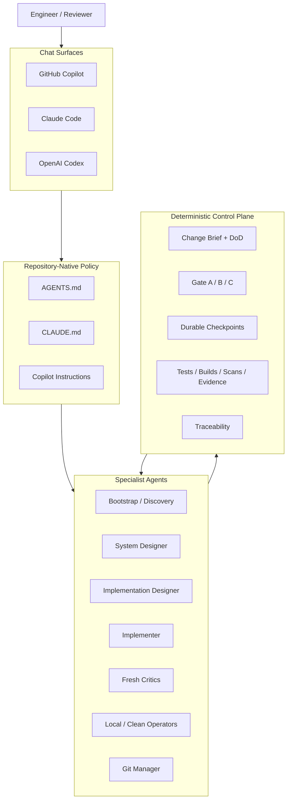
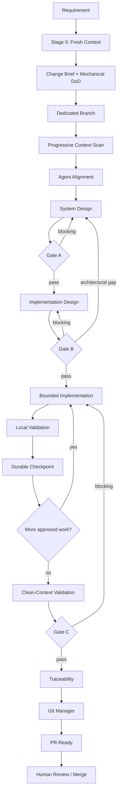
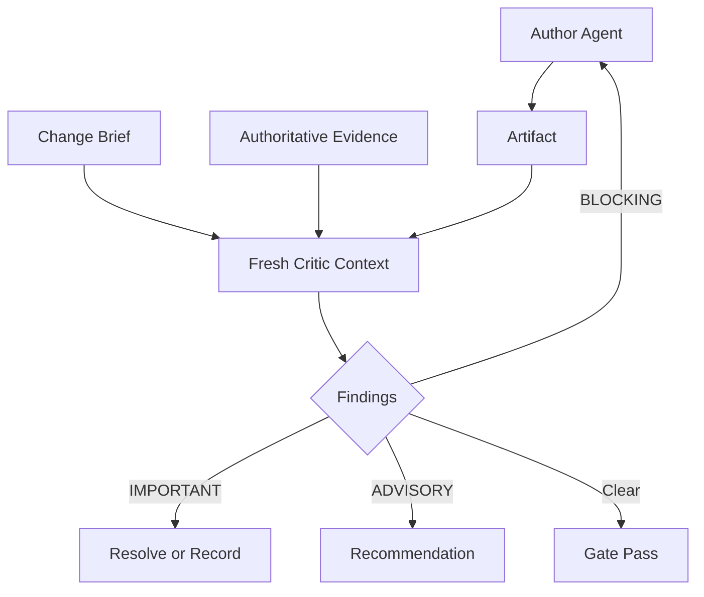
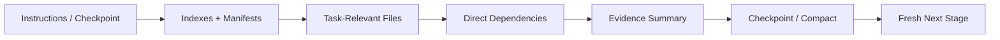
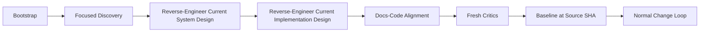
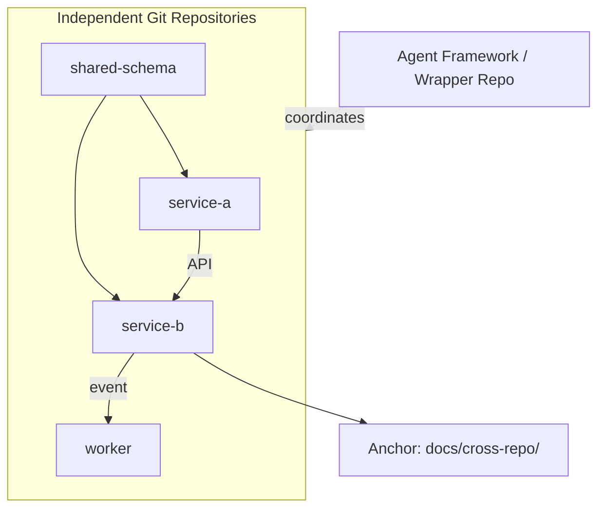
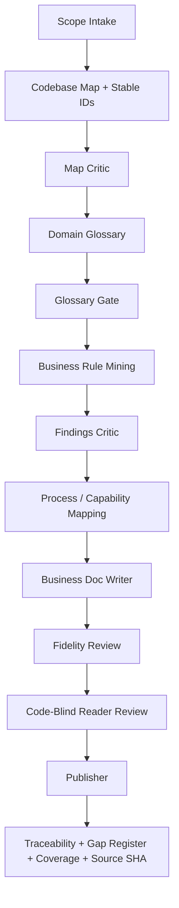
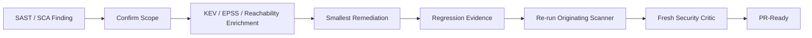

# agentic-dev-kit

A repository-native, cross-tool **agentic engineering operating system** for GitHub Copilot, Claude Code, and OpenAI Codex.

It is intentionally not a Python orchestration runtime. The repository itself carries the operating model: specialist agents, reusable skills, prompt entry points, deterministic contracts, durable checkpoints, evidence rules, critics, and engineering loops that users invoke directly from chat.

> **Models may reason and propose. Deterministic evidence decides.**

## Why this exists

AI coding assistants are powerful, but a single unconstrained chat session tends to mix discovery, architecture, implementation, testing, review, and Git operations into one context. That makes it easy to lose decisions, accept unverified assumptions, overrun context, or let the same model author and approve its own work.

`agentic-dev-kit` separates those responsibilities and surrounds non-deterministic reasoning with explicit control points.

## Platform architecture



## Core engineering lifecycle

The canonical workflow for substantial features, bug fixes, refactors, and behavioral changes is `incremental-design-build`.



### Gate A — System Design Readiness

The design must define:
- boundaries and responsibilities;
- interfaces/contracts;
- invariants;
- state/data/control flows;
- failure and recovery semantics;
- security/reliability/observability;
- compatibility constraints;
- explicit unknowns and rejected alternatives.

A fresh Design Critic reviews it.

### Gate B — Implementation Design Readiness

The technical plan must define:
- exact files/modules/symbols;
- APIs/schemas/state;
- dependencies;
- error/retry contracts;
- migration/compatibility;
- unit/integration/E2E tests;
- telemetry;
- rollout/rollback;
- exact validation commands.

A fresh Implementation Plan Critic reviews it.

### Gate C — Implementation + Validation Closure

A fresh Implementation Critic reviews:
- Change Brief + Definition of Done;
- approved designs;
- actual diff;
- local/clean validation;
- docs;
- residual risks;
- traceability.

The workflow ends **PR-ready**, not silently merged.

## Separation of powers

```mermaid
flowchart LR
    R[Requirement] --> BOOT[Repository Bootstrapper]
    BOOT --> SD[System Designer]
    SD --> C1[Design Critic]
    C1 --> ID[Implementation Designer]
    ID --> C2[Implementation Plan Critic]
    C2 --> IMP[Implementer]
    IMP --> L[Local Operator]
    L --> CLEAN[Clean-Repo Operator]
    CLEAN --> C3[Implementation Critic]
    C3 --> GM[Git Manager]
    GM --> H[Human]

    C1 -. no self-approval .-> SD
    C2 -. no self-approval .-> ID
    C3 -. no silent fix .-> IMP
```



The agent that authors an artifact should not be its only verifier.

## Fresh-context critics

Critics are deliberately given the requirement, artifact, and minimum authoritative evidence rather than the author's full conversational narrative.



Specialized critics include:
- Design Critic;
- Implementation Plan Critic;
- Implementation Critic;
- Map Critic;
- Findings Critic.

## Durable checkpoints

Long-running work should survive context compaction, model/session changes, and agent handoffs.

```text
.agents/checkpoints/<branch>/checkpoint.yaml
```

A checkpoint records branch/SHA, Change Brief, DoD, current gate, approved artifacts, changed files, validation results, findings, risks, next steps, and recommended next agent.

**Fail-safe rule:** if checkpoint state cannot be written or trusted, mutable work stops and the workflow falls back to read-only planning until durable state is restored.

## Progressive disclosure and context governance



The framework avoids loading an entire repository just because the model can. Context is treated as a finite engineering resource.

## Brownfield pre-loop

For unfamiliar repositories, establish current state before changing it.



For **current state**, executable code/config/tests are stronger evidence than stale prose unless an approved target design explicitly supersedes them.

## Multi-repository workflows



Rules:
- every sub-repository preserves independent Git state;
- cross-repo edges are confirmed or explicitly inferred;
- one anchor repository owns shared cross-repo artifacts;
- there is no separate docs repository by default;
- one Git mutation targets exactly one repository.

## Business documentation pipeline

The framework can also turn implementation evidence into business-readable documentation without inventing product intent.



Stable namespaces:
- `CMP` component
- `ENT` entity
- `STORE` persistence
- `INT` integration
- `JOB` background job
- `RULE` business rule
- `CAP` capability
- `PROC` process
- `TERM` glossary term

Critical rule: code can often prove **WHAT** the system does. It does not automatically prove **WHY** the business wants it.

## Security remediation chain



Included reusable security skills:
- `semgrep-sast-rules`;
- `trivy-sca-scanning`;
- `transitive-dependency-remediation`;
- `vuln-enrichment-prioritization`;
- `mitre-attack-mapping`;
- `security-remediation`.

A scanner that discovers zero expected packages/files/rules is **not** a clean scan.

## Specialist agents

### Core engineering
- Repository Bootstrapper
- Repository Analyst
- System Designer
- Implementation Designer
- Implementer
- Local Operator
- Clean-Repo Operator
- Git Manager
- Traceability Analyst
- Project Traceability
- Docs-Code Aligner
- Security Reviewer

### Fresh critics
- Design Critic
- Implementation Plan Critic
- Implementation Critic
- Map Critic
- Findings Critic
- Independent Critic

### Multi-repo
- Multi-Repo Bootstrapper
- Cross-Repo Discovery

### Business documentation
- Business Scope Intake
- Codebase Cartographer
- Domain Glossary Curator
- Business Rule Miner
- Process Capability Mapper
- Business Doc Writer
- Business Doc Publisher

## Reusable skills

### Engineering workflows
- `incremental-design-build`
- `feature-development`
- `bugfix`
- `brownfield-bootstrap`
- `reverse-engineer-design`
- `docs-code-alignment`
- `knowledge-discovery`
- `safe-refactor`
- `release-readiness`
- `multi-repo-bootstrap`
- `business-docs-loop`

### Analysis / control
- `repo-discovery`
- `architecture-analysis`
- `system-design`
- `implementation-design`
- `test-planning`
- `evidence-traceability`
- `context-governance`
- `git-safety`

### Tooling / security
- `frontmatter-indexer`
- `skill-scaffolding`
- `docker-podman-optimizer`
- `uv-python`
- `oauth2-pkce-integration`
- `enterprise-package-routing`
- `semgrep-sast-rules`
- `trivy-sca-scanning`
- `transitive-dependency-remediation`
- `vuln-enrichment-prioritization`
- `mitre-attack-mapping`

## Cross-tool mapping

| Capability | GitHub Copilot | Claude Code | OpenAI Codex |
|---|---|---|---|
| Repository policy | `.github/copilot-instructions.md` + `AGENTS.md` | `CLAUDE.md` + `AGENTS.md` | `AGENTS.md` |
| Specialist agents | `.github/agents/*.agent.md` | `.claude/agents/*.md` | canonical roles + skills |
| Workflow launchers | `.github/prompts/*.prompt.md` | `.claude/skills/*/SKILL.md` | `.agents/skills/*/SKILL.md` |
| Canonical skills | `.agents/skills/` | mirrored `.claude/skills/` | `.agents/skills/` |
| Contracts/docs | `docs/` | `docs/` | `docs/` |

## Invocation examples

### GitHub Copilot

Select a specialist from the Agent picker or invoke a prompt file:

```text
incremental-design-build: Add tenant-aware rate limiting.
bugfix: Fix duplicate event processing.
brownfield-bootstrap: Establish the current design of this repo before changes.
```

### Claude Code

```text
/incremental-design-build Add tenant-aware rate limiting.
/bugfix Fix duplicate event processing.
/knowledge-discovery Explain how authentication flows through this service.
/business-docs-loop Produce cited business documentation for this repository.
```

Use `/agents` to inspect specialist roles.

### OpenAI Codex

```text
$incremental-design-build Add tenant-aware rate limiting.
$bugfix Fix duplicate event processing.
$knowledge-discovery Explain authentication.
```

## Skill evals

High-value skills include repository-native eval fixtures under:

```text
.agents/skills/<skill>/evals/eval.json
```

Evals define positive/negative trigger cases, required behaviors, and forbidden behaviors. Claude skill directories are mirrored from the canonical `.agents/skills` tree.

## Validation

```bash
make validate
```

The repository validation checks structure, frontmatter, agent parity, skill parity, and eval fixture integrity.

## Clean-room notice

This is an original public framework reconstructed from general engineering patterns and first-principles agentic-system design. It intentionally contains no employer-confidential source code, private prompts, internal endpoints, credentials, proprietary schemas, security findings, or confidential documentation.

## License

MIT
