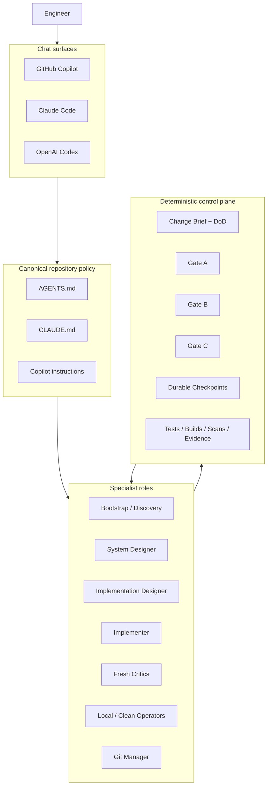
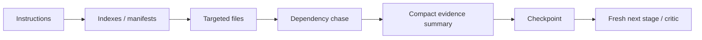

# Architecture

`agentic-dev-kit` is a repository-native agent operating system. There is no required orchestration server. The repository itself carries the policies, specialist roles, skills, prompts, contracts, and loops that coding assistants invoke from chat.

## Cross-tool architecture



## Repository layout

```text
.
├── AGENTS.md
├── CLAUDE.md
├── .agents/
│   ├── skills/
│   └── checkpoints/            # optional runtime state; normally gitignored
├── .claude/
│   ├── agents/
│   └── skills/
├── .github/
│   ├── agents/
│   ├── prompts/
│   ├── instructions/
│   └── copilot-instructions.md
└── docs/
    ├── contracts/
    ├── workflows/
    └── ...
```

## Separation of powers

```mermaid
flowchart LR
    R[Requirement] --> BOOT[Bootstrapper]
    BOOT --> SD[System Designer]
    SD --> C1[Fresh Critic]
    C1 -->|pass| ID[Implementation Designer]
    ID --> C2[Fresh Critic]
    C2 -->|pass| IMP[Implementer]
    IMP --> OP[Local Operator]
    OP --> CLEAN[Clean-Repo Operator]
    CLEAN --> C3[Fresh Critic]
    C3 -->|pass| GM[Git Manager]
    GM --> H[Human PR / Merge Decision]

    C1 -->|blocking| SD
    C2 -->|blocking| ID
    C3 -->|blocking| IMP
```



## Artifact hierarchy

The canonical artifacts are:
1. Change Brief + mechanical Definition of Done;
2. current-state evidence map;
3. system design;
4. Gate A findings;
5. implementation design;
6. Gate B findings;
7. implementation diff;
8. validation evidence;
9. Gate C findings;
10. PR-ready summary and residual-risk register.

## Context strategy



The framework intentionally avoids carrying every raw file and every prior model thought into every later stage.
