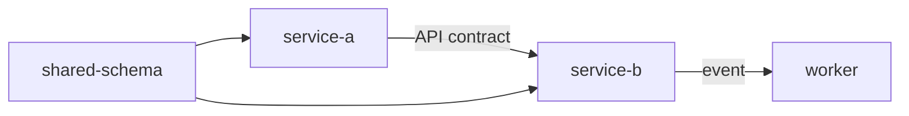

# Multi-Repo Contract

Use this contract when one requirement spans multiple Git repositories.

## Inventory

Maintain a canonical inventory, for example:

```json
{
  "repositories": [
    {
      "name": "service-a",
      "source_url": "...",
      "requested_branch": "main",
      "current_branch": "main",
      "head_sha": "...",
      "path": "repos/service-a",
      "role": "producer"
    }
  ]
}
```

Recommended location: `docs/multi-repo/inventory.json`.

## Git separation

The wrapper repository contains the agent framework. Each sub-repository under `repos/<name>/` preserves its own `.git`, remote, branch, and history.

Never issue one Git mutation as if wrapper + sub-repositories were a single repository.

## Documentation ownership

There is no separate "documentation repository" by default.

Each application's system/implementation documentation lives with that application.

Shared cross-repo artifacts live in an elected **anchor repository** under a path such as:

```text
docs/cross-repo/
├── dependency-map.md
├── contracts.md
├── rollout-order.md
└── validation-plan.md
```

## Anchor election

Prefer the repository that:
1. owns the shared contract; or
2. is the dependency root; or
3. has the highest number of confirmed inbound integration references.

If no clear anchor exists, record the decision as explicit and human-reviewable.

## Discovery output

Cross-repo discovery should identify:
- APIs/events/shared schemas;
- shared libraries/packages;
- ownership boundaries;
- deploy-order dependencies;
- compatibility constraints;
- coordinated migrations;
- integration tests;
- confirmed vs inferred dependency edges.

## Mermaid dependency graph



Actual projects should replace the example with evidence-backed edges.

## Guardrails

- resolve destinations under `repos/`; block path traversal;
- do not overwrite non-empty destinations;
- do not force-checkout/reset away local work;
- confirm clone/branch plans before mutation;
- identify the target repository before every Git operation;
- cross-repo artifacts must cite the commit SHA of each repository inspected.
