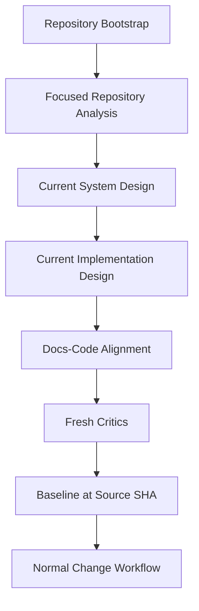

# Brownfield Discovery

Brownfield discovery establishes a trustworthy current-state model before design changes begin.

## Required baseline
- repository fingerprint and source SHA;
- build/test/deploy commands;
- architecture boundaries/contracts;
- implementation file/symbol map;
- data/state/integration paths;
- relevant tests;
- docs/code drift;
- confirmed/documented/inferred/unknown register.

Do not infer historical intent from implementation structure alone.
