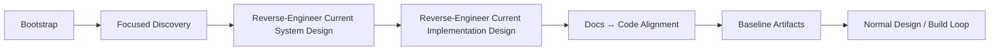

# Brownfield Pre-Loop

Use this before modifying an unfamiliar or poorly documented existing repository.

## Step 1 — Bootstrap
Capture repository identity, branch/SHA, instructions, stack, build/test/deploy entry points, docs inventory, and known adjacent repositories.

## Step 2 — Focused discovery
Map entry points, boundaries, APIs, persistence, integrations, control/data flow, and relevant tests.

## Step 3 — Reverse-engineer system design
Describe current boundaries, contracts, invariants, flows, and failure behavior. Mark inference explicitly.

## Step 4 — Reverse-engineer implementation design
Map the current design to files, modules, classes/functions, schemas, state, integrations, tests, CI/CD, and deployment evidence.

## Step 5 — Docs/code alignment
Classify each important claim:
- aligned;
- docs stale;
- implementation diverged from approved design;
- ambiguous;
- unknown.

## Step 6 — Baseline
Produce a compact current-state baseline before entering a feature/bug/refactor loop.

### Source-of-truth rule
For **current state**, executable code/config/tests are stronger evidence than stale prose unless an approved target design explicitly supersedes them.

Do not invent historical rationale that the repository does not document.
