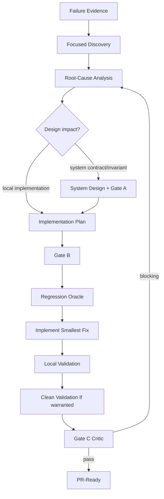

# Bugfix Loop

## Failure packet
Record expected behavior, actual behavior, reproduction steps, environment, logs/errors, affected version/SHA, and impact.

## Root cause
Trace the smallest responsible boundary. Separate:
- observed symptom;
- contributing conditions;
- confirmed root cause;
- unresolved hypotheses.

If the failure violates a system contract/invariant, update system design rather than hiding the architectural change in code.

## Regression oracle
Prefer a deterministic test that fails before and passes after the fix. If no automated oracle is feasible, record the exact manual/replay command and its limitation.

## Scope discipline
Do not bundle opportunistic refactors unless they are necessary to make the fix safe and are explicitly included in the Change Brief.

## Closure
Gate C must verify the original failure is closed, relevant regression coverage passes, no hidden contract drift exists, and documentation is current.
