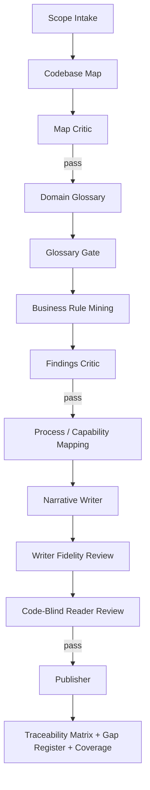

# Business Documentation Loop

This workflow turns implementation evidence into business-readable documentation without inventing product intent.

## Pipeline

## Stage 1 — Scope intake
Define audience, repository scope, business questions, exclusions, output format, and evidence rules.

## Stage 2 — Codebase map
Build stable evidence IDs for major components and concepts. Suggested namespaces:
- `CMP-###` component;
- `ENT-###` entity;
- `STORE-###` persistence;
- `INT-###` integration;
- `JOB-###` scheduled/background job;
- `RULE-###` business rule;
- `CAP-###` capability;
- `PROC-###` process;
- `TERM-###` glossary term.

A fresh Map Critic reviews coverage/evidence before later stages.

## Stage 3 — Glossary gate
Define domain terms before narrative writing. Later stages must not introduce unexplained domain terms.

## Stage 4 — Business rules
Mine decision logic and tables from code/config/tests.

Separate:
- **WHAT** the system does — may be confirmed by executable evidence;
- **WHY** it does it — only documented if an authoritative source says so; otherwise inferred/unknown.

Every rule carries evidence class + source.

## Stage 5 — Process/capability mapping
Reconstruct business capabilities and swimlane/process flows. Every material step must trace to evidence.

## Stage 6 — Narrative synthesis
The writer receives approved findings, not unrestricted code access. It may reorganize and explain, but must introduce **zero new factual claims**.

## Stage 7 — Fidelity + code-blind review
One critic verifies every narrative claim against approved evidence. A separate code-blind reader reviews clarity, jargon, unexplained identifiers, and whether a non-technical reader can understand the process.

## Stage 8 — Publish
Produce:
- business narrative;
- diagrams/tables;
- glossary;
- traceability matrix;
- gap/unknown register;
- evidence coverage report;
- source commit SHA(s).

## Drift
Published artifacts should record source SHA(s). When source changes, stale documentation is detectable instead of silently trusted.
