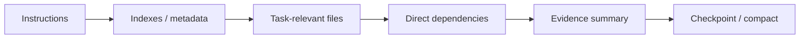

# Context Governance

Context is treated as an engineering resource.

## Progressive disclosure

## Rules

- Do not read the entire repository when a targeted map is sufficient.
- Prefer symbol/file indexes to raw dumps.
- Preserve decisions/evidence in durable artifacts instead of relying on scrollback.
- Critics receive fresh context rather than the author's full conversational history.
- Before a long session becomes dominated by stale investigation or repeated output, checkpoint and compact.
- If context has been compacted, reload the authoritative checkpoint and required artifacts before mutation.
- When the next action depends on evidence not currently loaded, retrieve the evidence instead of guessing.

## Handoff packet

A compact stage transition should include:
- Change Brief;
- current gate/stage;
- approved upstream artifacts;
- relevant evidence paths;
- open findings;
- exact next responsibility;
- checkpoint path.

## Degraded mode

If reliable context or checkpoint state is unavailable, operate read-only until it is restored.
