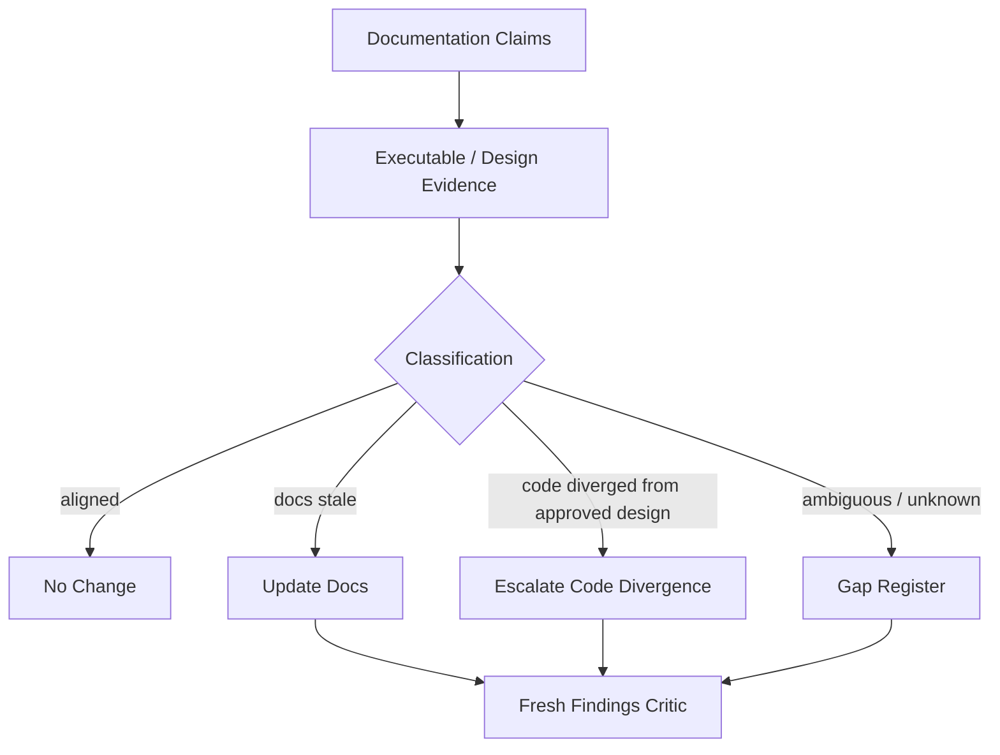

# Docs ↔ Code Alignment Workflow

```mermaid
flowchart TD
    D[Documentation Claims] --> E[Executable / Design Evidence]
    E --> C{Classification}
    C -->|aligned| A[No Change]
    C -->|docs stale| UD[Update Docs]
    C -->|code diverged from approved design| EC[Escalate Code Divergence]
    C -->|ambiguous / unknown| G[Gap Register]
    UD --> R[Fresh Findings Critic]
    EC --> R
    G --> R
```

The workflow never hides real divergence by changing the easiest side. It first decides which artifact is authoritative for the claim being evaluated.
