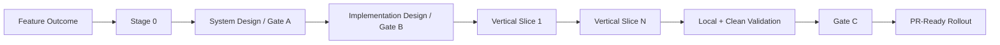

# Feature Development Loop

Feature development is the Incremental Design/Build loop specialized for net-new behavior.

## Requirements
Define outcomes, non-goals, compatibility, migration, security/reliability expectations, observability, and rollout constraints.

## Vertical slices
Prefer slices that traverse the real path end-to-end and can be deterministically validated. Avoid creating layers of disconnected scaffolding when a smaller working slice is possible.

## Rollout
For risky capabilities, include feature flag/canary/limited exposure, monitoring signals, rollback trigger, and rollback mechanism.

## Closure
Every acceptance criterion must trace to a design decision, implementation location, and observed validation evidence.
