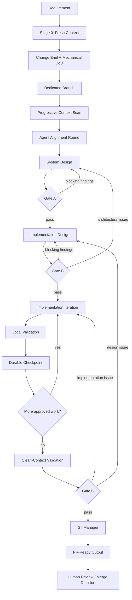

# Incremental Design / Build Loop

This is the canonical lifecycle for substantial features, bug fixes, refactors, and behavioral changes.

## Overview

## Stage 0 — Fresh context

Every substantial change begins from repository reality, not stale conversational assumptions.

Collect:
- repo identity, branch, HEAD SHA, remotes;
- applicable repository instructions;
- stack/build/test/package/deploy entry points;
- task-relevant directory and symbol map;
- existing tests covering the area;
- current documentation and docs/code drift;
- neighboring repositories/contracts when relevant;
- risks, constraints, and unknowns.

Output:
1. task-focused evidence map;
2. Change Brief;
3. mechanical Definition of Done;
4. initial validation plan;
5. recommendation for required specialist roles.

## Branch creation

Before mutable implementation work:
- create/switch to a dedicated feature or fix branch;
- do not overwrite an existing branch unexpectedly;
- do not reset/clean away local changes;
- record branch and HEAD SHA in the checkpoint.

## Progressive context scan

Read context in layers:
1. instructions + checkpoint;
2. manifests/indexes/metadata;
3. relevant files/symbols;
4. direct dependencies/callers;
5. deeper transitive context only if needed.

When context begins accumulating stale exploration, checkpoint and compact rather than continuing to append raw data.

## Agent-alignment round

Before design gates, align active roles on:
- goal/non-goals;
- requirements;
- known evidence;
- constraints;
- definition of done;
- unresolved questions;
- expected artifacts.

This is not group consensus theater. Its purpose is to expose conflicting assumptions before they become code.

## Stage 1 — System design

System Designer produces technology-agnostic design:
- boundaries;
- actors/components;
- contracts;
- invariants;
- state/data/control flows;
- failure behavior;
- security;
- reliability;
- observability;
- explicit unknowns;
- rejected alternatives.

### Gate A
A fresh-context design critic reviews only the Change Brief, design artifact, and minimum authoritative evidence.

`BLOCKING` → return to System Designer.
`IMPORTANT` → resolve or explicitly record.
`ADVISORY` → may remain as recommendation.

## Stage 2 — Implementation design

Implementation Designer converts the approved system design to repository-specific technical design:
- exact files/modules;
- concrete functions/classes;
- API/schema/state changes;
- dependency changes;
- error behavior;
- compatibility/migration;
- unit/integration/E2E tests;
- telemetry;
- rollout/rollback;
- exact validation commands.

### Gate B
A fresh critic checks feasibility, completeness, traceability, and whether implementation can proceed without inventing architecture.

Architectural gaps reopen Gate A.

## Stage 3 — Incremental implementation

Implement approved work in small, independently verifiable slices.

Each iteration:
1. reload only necessary context;
2. implement the smallest approved slice;
3. add/update tests;
4. run targeted local validation;
5. record changed files/results;
6. update checkpoint;
7. decide whether another iteration is warranted.

### Iteration discipline
Avoid indefinite same-session loops. After several substantial iterations, prefer a durable checkpoint and a fresh continuation so later reasoning is not dominated by accumulated implementation history.

## Local validation

Local Operator runs the relevant deterministic checks in the working tree:
- format/lint;
- type/static analysis;
- unit tests;
- integration tests;
- builds/packages;
- security scanners;
- targeted smoke tests.

The exact commands and results are evidence.

## Clean-context validation

For substantial/release-bound work, Clean-Repo Operator verifies:
- clean checkout/worktree;
- dependency installation from authoritative manifests/lockfiles;
- build from scratch;
- relevant tests;
- generated artifact reproducibility;
- environment assumptions.

Local success does not substitute for this evidence.

## Gate C — Closure

A fresh critic reviews:
- Change Brief + DoD;
- approved designs;
- actual diff;
- local/clean validation;
- docs;
- residual risks;
- checkpoint consistency.

Gate C is blocked by:
- missing required validation;
- unexplained scope/design drift;
- unresolved blocking findings;
- stale material documentation;
- misleading completion claims.

## Single-writer mutation discipline\n\nOnly one role owns mutable repository work at a time. Implementer may edit approved product files during its slice; ownership is handed off explicitly to validation/review roles. **Git Manager is the sole role that creates commits.** No two agents should concurrently mutate the same repository.\n\n## PR-ready output

Git Manager prepares:
- branch/status summary;
- staged/unstaged diff summary;
- validation summary;
- requirement-to-evidence summary;
- remaining risks;
- proposed commit/PR message.

No automatic merge is implied.

## Failure policy

If checkpointing fails, context cannot be trusted, or a required artifact is missing:
- stop mutation;
- preserve current state;
- fall back to read-only planning/diagnosis;
- restore durable state before resuming.
