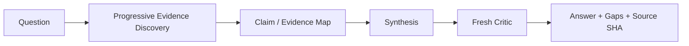

# Knowledge Discovery Loop

The canonical workflow is documented in [knowledge-discovery.md](./knowledge-discovery.md).

Use confirmed/documented/inferred/unknown classifications and keep WHAT separate from unsupported WHY.
