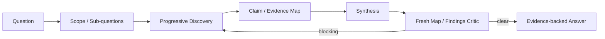

# Knowledge Discovery Workflow

## Discipline
A knowledge workflow is not a code-change workflow. Its product is a trustworthy explanation with explicit evidence boundaries.

Current behavior is grounded primarily in executable code/config/tests. Historical/business rationale requires authoritative documentation; otherwise keep it inferred/unknown.

Record the source commit SHA so the answer has a known freshness boundary.
