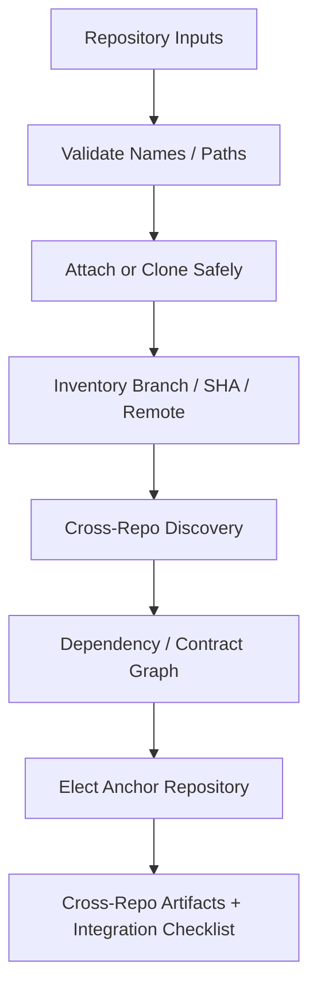

# Multi-Repo Bootstrap Loop

## Safety
Never overwrite a non-empty checkout, discard local changes, or run a Git operation across wrapper and sub-repositories together.

## Discovery
Cross-repo relationships remain `inferred` unless supported by code/config/schema/deploy evidence.

## Documentation
Each application owns its local design docs. Shared cross-repo contracts and rollout artifacts live in the elected anchor repository.
