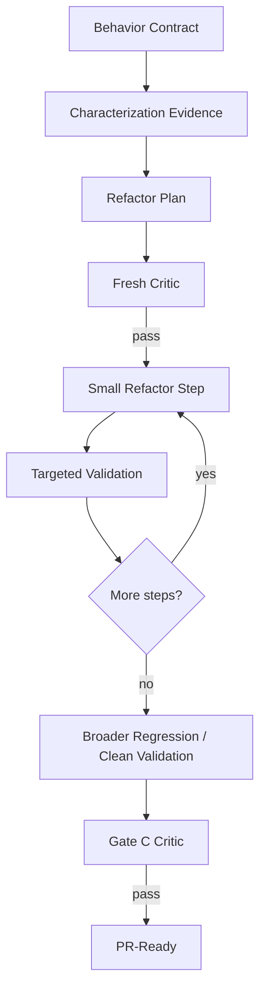

# Safe Refactor Loop

## Behavior contract
Capture externally observable behavior that must not change: interfaces, schemas, side effects, state transitions, error semantics, ordering, timing-sensitive guarantees, and relevant performance constraints.

## Characterization
Use existing tests and add focused characterization tests where current behavior is insufficiently protected.

## Scope
A refactor Change Brief should explicitly list prohibited behavior changes. If a real feature/bug change becomes necessary, split or reopen the design workflow.

## Validation
Compare not only unit tests but also contract tests, integration behavior, generated artifacts, public signatures, and relevant operational behavior.

## Closure
The final critic asks one question above all: "What observable behavior changed that was not authorized?" Any credible answer blocks closure.
