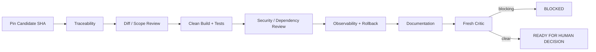

# Release Readiness Loop

## Candidate immutability
Review a specific SHA. If the branch changes after review, affected evidence must be refreshed.

## Required packet
- acceptance criteria → evidence;
- diff/scope summary;
- local/clean validation;
- security/dependency state;
- migration/backward compatibility;
- observability;
- rollout/rollback;
- documentation;
- residual risks/accepted exceptions.

## Human boundary
The workflow determines whether evidence is sufficient for a human decision. It does not autonomously release or merge.
