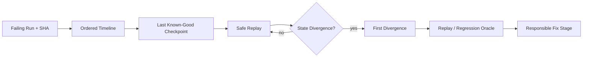

# Replay / Time-Travel Debugging

The goal is to find the **first** incorrect transition, not to explain only the final error.

Persisted run/checkpoint/event/tool evidence is authoritative. Missing history stays missing. If exact model replay is impossible, separate deterministic state/tool replay from a fresh nondeterministic model execution.

Original run evidence remains immutable, and replay must not re-trigger destructive external writes.
