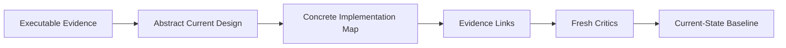

# Reverse-Engineer Design Workflow

The workflow deliberately reconstructs **current state**, not an idealized architecture.

Keep rationale separate from structure: code may confirm WHAT the system does without proving WHY it was designed that way.
