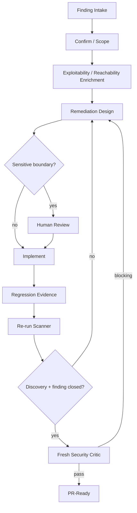

# Security Remediation Loop

## Finding contract
Preserve scanner/rule/CVE identity and original evidence. Enrichment adds prioritization context but does not rewrite the source finding.

## Sensitive-boundary rule
Authentication, authorization, cryptography, secrets, trust boundaries, and production permissions require explicit human review before an automated remediation is accepted.

## Verification invariant
The closing scan must prove both:
1. the expected target was actually discovered/scanned;
2. the specific finding is absent or otherwise resolved.

A successful scanner exit with zero expected discovery is not closure.
